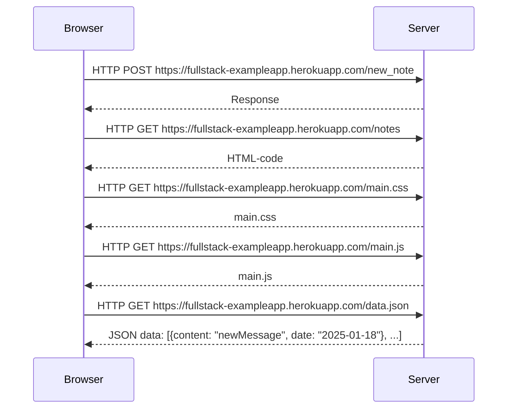

```mermaid
sequenceDiagram
    participant Browser
    participant Server

    Browser->>Server: HTTP POST https://fullstack-exampleapp.herokuapp.com/new_note
    Server-->>Browser: Response

    Browser->>Server: HTTP GET https://fullstack-exampleapp.herokuapp.com/notes
    Server-->>Browser: HTML-code

    Browser->>Server: HTTP GET https://fullstack-exampleapp.herokuapp.com/main.css
    Server-->>Browser: main.css

    Browser->>Server: HTTP GET https://fullstack-exampleapp.herokuapp.com/main.js
    Server-->>Browser: main.js

    Browser->>Server: HTTP GET https://fullstack-exampleapp.herokuapp.com/data.json
    Server-->>Browser: JSON data: [{content: "newMessage", date: "2025-01-18"}, ...]

```
